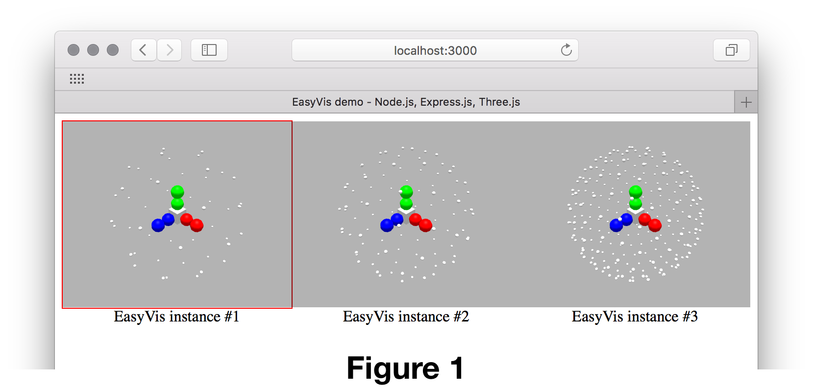

# EasyVis

_A simple example for cross-platform 3D visualization using WebGL via Three.js_

Includes example Docker file for building containerized derivatives for deployment on e.g. Amazon Web Services.

## Requirements

* [Three.js](https://threejs.org/)
* [Node.js](https://nodejs.org/) (for simple test server)

The example Node.js server also makes use of some standard tools ([Express](https://expressjs.com/), [Compression](https://www.npmjs.com/package/compression), [Helmet](https://github.com/helmetjs/helmet)) which are available via available via [npm](https://www.npmjs.com/).

## Platform compatibility

In principle, anything that supports Three.js (and/or Node.js)!

## Example usage

For a quick and simple test, run the provided `server.js` script with Node:

	EasyVis $ node server.js EasyVis.html

... and then point your web browser to `localhost:3000`.

The example Web page (`EasyVis.html`) sets up three `div` elements of class `EasyVis`. These `div` elements are identified by the client browser (see `client.js`), which then inserts a new `canvas` element into each to act as the target for an EasyVis instance. Each renderer then posts a `GET` request to `/scene/X`, with `X` an integer ID to identify the specific EasyVis instance.

If all went well, one should observe three separate EasyVis instances side-by-side in the web browser, each with a similar (but different!) test scene displayed (**Fig. 1**).

## Notes

To ensure the EasyVis views resize correctly, we must take care to ensure:

* Any enclosing containers should specified "fr" units in a grid view, rather than "auto" etc.
* `div` elements containing an EasyView should set `min-height` and `min-width` properties to 0; this prevents e.g. grid elements becoming larger on window resize, _but not being able to shrink again_ (due to the inability of e.g. a grid element to be smaller than its content).